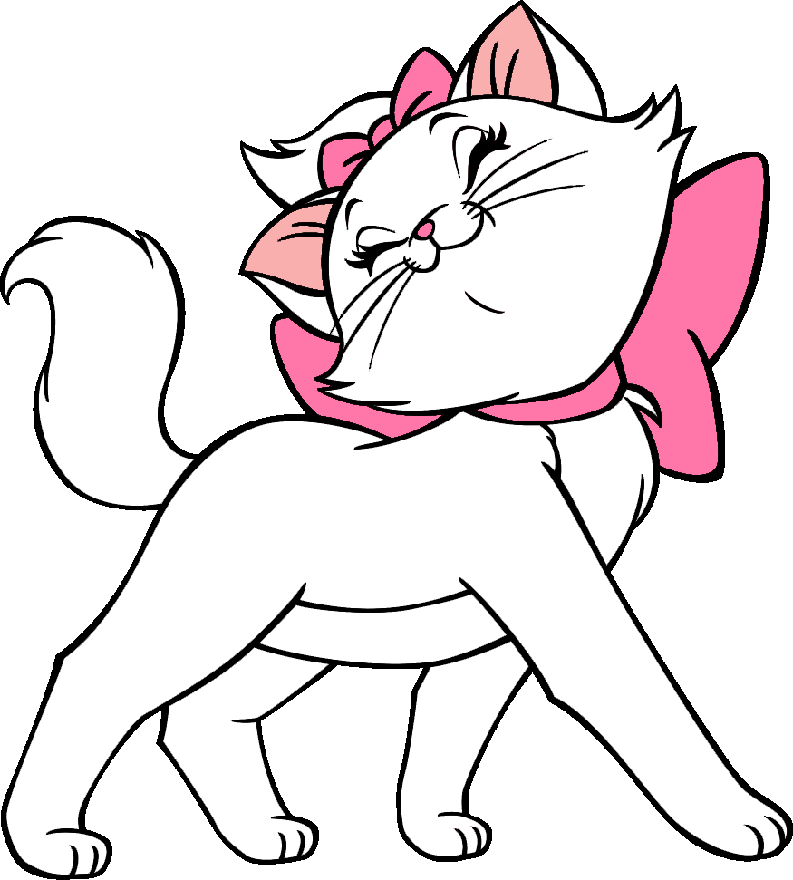

    

<h1> Olá pessoal!  </h1>

 Meu nome é Vitória Rossi. Obrigada por tirar um tempo para ver meu GitHub. Seja bem vindo(a)! :smile: 

<h2> Sobre mim </h2>

- 🔭 Estou estudando Informática
  
- 🌱 Estou aprendendo C#
  
- 👯 Estou buscando colaborar em projetos
  
- ⚡ Curiosidade: Sou representante da minha turma

<h2> Skills  </h2>

<h2> Conecte-se comigo  </h2>

 
  
 

-----
Créditos: [Aditya Deshmukh](https://github.com/Aditya664)

Editado em: 01/01/2025
